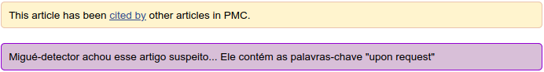

# Migué-Detector

**A extensão ainda está em estágio pré-alfa e não está disponível para download pelos repositórios oficiais Firefox Extensions/Chrome web store**

Extensão detectora de migués (dados pseudoabertos), feito como parte da No Budget Science Hackweek 2020

Enquanto você navega por artigos do [Pubmed Central](https://www.ncbi.nlm.nih.gov/pmc/), o migué-detector busca palavras-chave no texto que podem 
indicar a indisponibilidade dos dados, como "available upon reasonable request", te mantendo consciente do que está lendo.

## Exemplos

Caso negativo:

Caso positivo:

## Como testar a versão pré-alfa

### Firefox

1. [Faça o download deste repositório.](https://github.com/jvfe/migue-detector/archive/master.zip)
2. Descompacte o arquivo .zip baixado.
3. Navegue até `about:debugging` e selecione a aba à esquerda "This firefox"
4. Clique o botão "Load temporary add-on" e selecione qualquer arquivo dentro do diretório descompactado. 

[Ícone por AnaBia](https://www.instagram.com/anabia.mor/)
